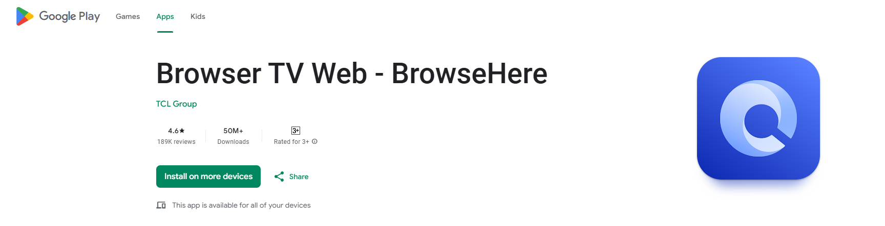

The OOBE Setup for the system is straightforward.

1. Sign-in with an account to accesss Google Play Store and related services (if Google is your way to go, otherwise use microG)
2. Skip over items that need extras like a Bluetooth Remote. We shall configure a remote [here](../maintenanceupdates.md)

After going through, we need to set up some more items.

1. After logging into your google account, we need a Browser, so you can download either Browser or Downloader

<figure markdown="span">
  { width="700" }
</figure>

<figure markdown="span">
  { width="700" }
</figure>

This will help enable us to download and install APKs externally that aren't available natively to run and use.

The next page will go over on setting up recommended apps. If you wish to skip that, you can directly go to [Maintenance & Updates](../maintenanceupdates.md)

   

