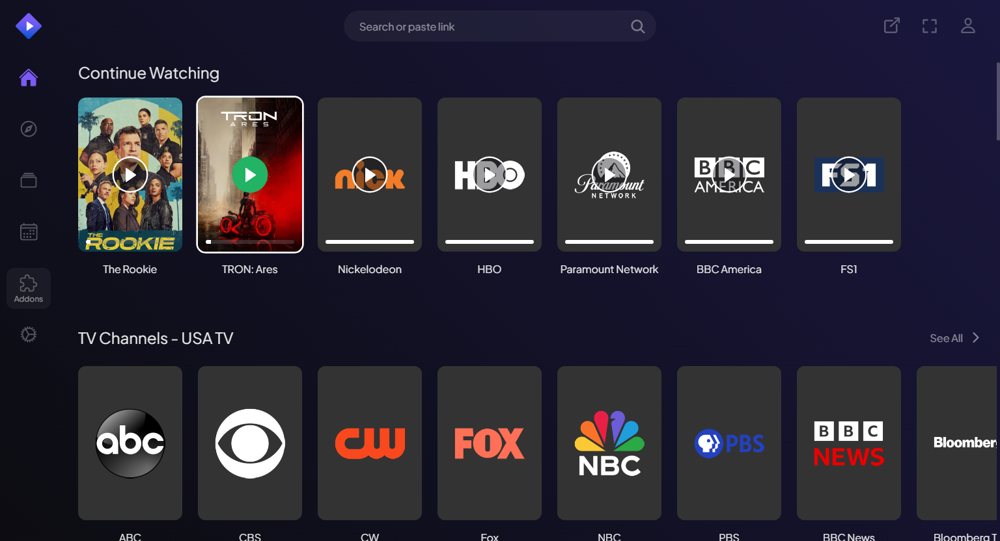
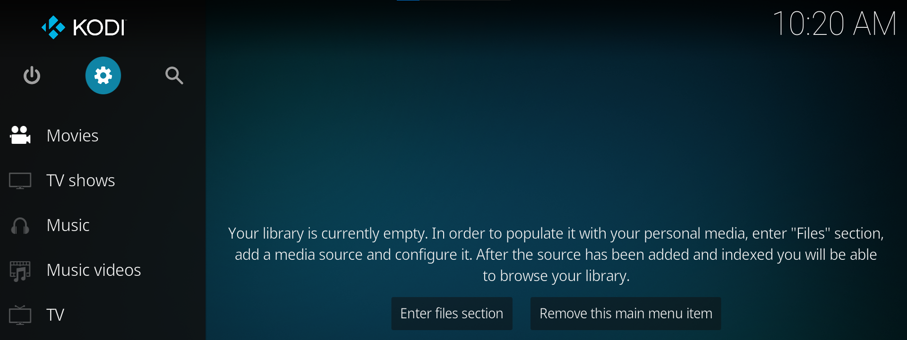
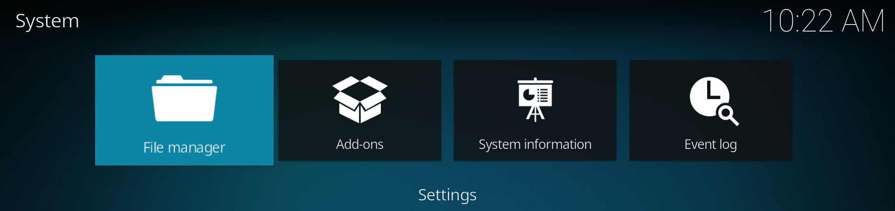
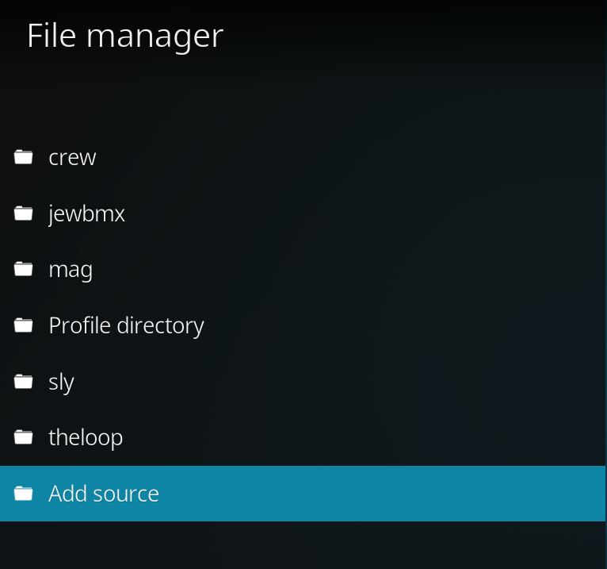
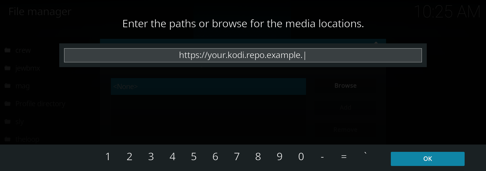
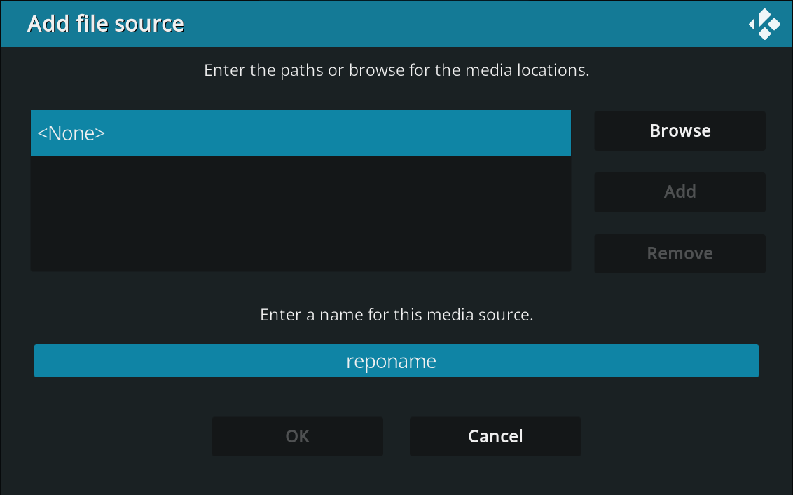
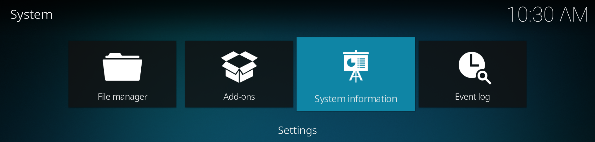
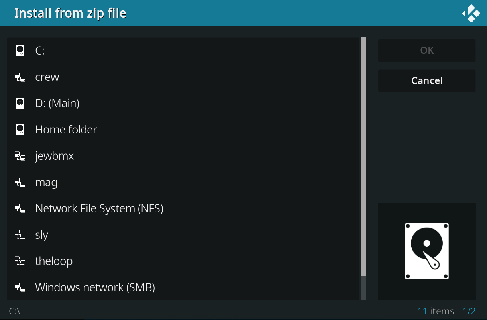
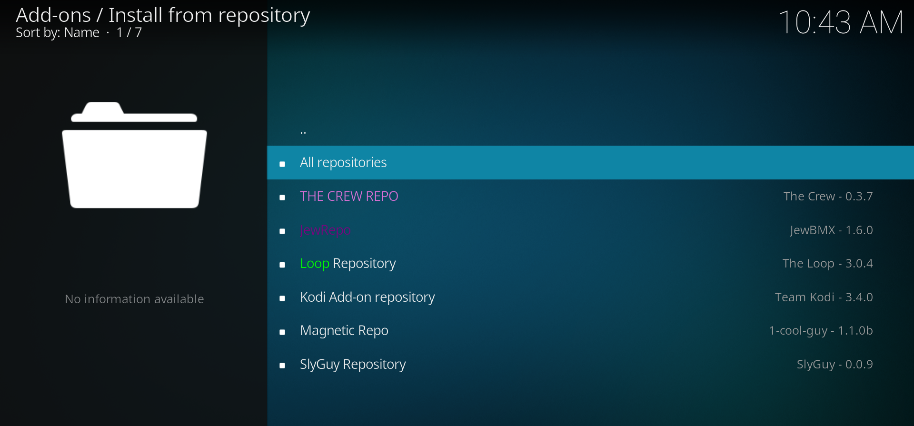

Here are some of the apps I recommend, and will be using in the following Base Setup.

!!! note

    This part is optional. If you do not want to use the apps recommended here, you can directly skip to [Maintenance & Updates](../maintenanceupdates.md)

!!! failure "Legal"

    Make sure to adhere to digital guidelines respective of your country before continuing to install and configure the apps as most of these have torrenting streams that may violate the guidelines of your ISP

!!! tip "About OnStream"

    I am unaware of the original app's link, so we shall be using [this link](https://onstreamapks.app/app/onstream-TV-1.0.7.apk) as I found this to work on my case without downloading external players.

<div class="grid cards" markdown>

- :simple-stremio: [__Stremio__](https://play.google.com/store/apps/details?id=com.stremio.one) for customizable streams for Movies and TV Shows
- :material-youtube-tv: [__SmartTube__](https://github.com/yuliskov/SmartTube/releases/download/30.68s/SmartTube_stable_30.68_x86.apk) which is a better version of YouTube for TV with SponsorBlock and DeArrow
- :material-diamond: [__Onstream__](https://onstreamapks.app/app/onstream-TV-1.0.7.apk) for a wider and broad selection of Movies and TV Shows. Has a bigger scraper
- :simple-kodi: [__Kodi__](https://play.google.com/store/apps/details?id=org.xbmc.kodi) for accessing TV media like TV Channels and Channel-specific content.

</div>

- Out of the box, OnStream is configured. You can immediately start watching stuff.  
- SmartTube just needs a Google Account that you can use to see your subscriptions and recommended / tailored content. For Stremio and Kodi, you can see them in their respective sub-headings.


### Stremio Setup

<figure markdown="span">
  { width="800" }
</figure>

!!! tip
    
    Viren070 has a perfect guide on setting up Stremio. See it [here](https://guides.viren070.me/stremio)

### Kodi Setup

Kodi uses repositories to retrieve information on them that help to set-up TV Channels, Shows and Movies. Each repo has it's own perks, and one should do a mix and match to have multiple sources incase one fails, or the other.

#### How to install repositories and repo contents in Kodi

- Open up Kodi, and go to the top left corner and select the settings.
<figure markdown="span">
  { width="700" }
</figure>

- Next, go to the File Manager.

<figure markdown="span">
  { width="700" }
</figure>

- Click on ```Add source``` and enter the URL of the repository you want to add.

<figure markdown="span">
  { width="500" }
</figure>

<figure markdown="span">
  { width="700" }
</figure>

- Next, name the source any name you want, and click ```Ok```

<figure markdown="span">
  { width="500" }
</figure>

- The repo should be added without any errors.
- Now go back to the settings panel, and go to ==Add-ons==

<figure markdown="span">
  { width="700" }
</figure>

- Select ```Install from zip-file``` and navigate to the name of the source you specified while adding the source.

<figure markdown="span">
  { width="700" }
</figure>

- Press ```Enter``` and allow it to finish installing the repository.

- Next, go to the same page again and select ```Install from repository```

<figure markdown="span">
  { width="800" }
</figure>

- You should see the repo added to the lists, select the repo, navigate to ```Video Add-ons``` and install the related addons (Most will have a description on each)

- After installing, you should see the add-on's related content appear in the main window of Kodi in the Add-ons section.


#### Recommended list of repositories

Magnetic Repository - Mad Titan Sports v2.0 - [https://www.magnetic.website/repo](https://www.magnetic.website/repo)  
SlyGuy Repository - Samsung TV Plus and many other cool TV subs - [https://slyguy.xyz](https://slyguy.xyz)  
The Loop - Offers sports, TV etc - [https://loopaddon.uk/theloop](https://loopaddon.uk/theloop)  
JewBMX - Many stuff - [https://jewbmx.github.io](https://jewbmx.github.io)  
The Crew - Very good repo - [https://team-crew.github.io](https://team-crew.github.io)

##### Debrid-based addon(s)

Umbrella  
FEN Light  
Seren  

Configuration for these are available in their respecitve sites or Addons Set-up Sites

<div align=center>
  <script type='text/javascript' src='https://storage.ko-fi.com/cdn/widget/Widget_2.js'></script><script type='text/javascript'>kofiwidget2.init('Support me on Ko-fi', '#72a4f2', 'I2I51O7J3E');kofiwidget2.draw();</script> 
</div>