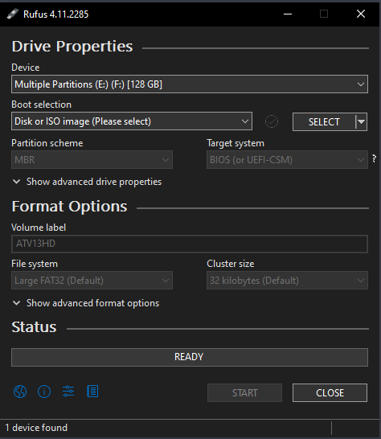
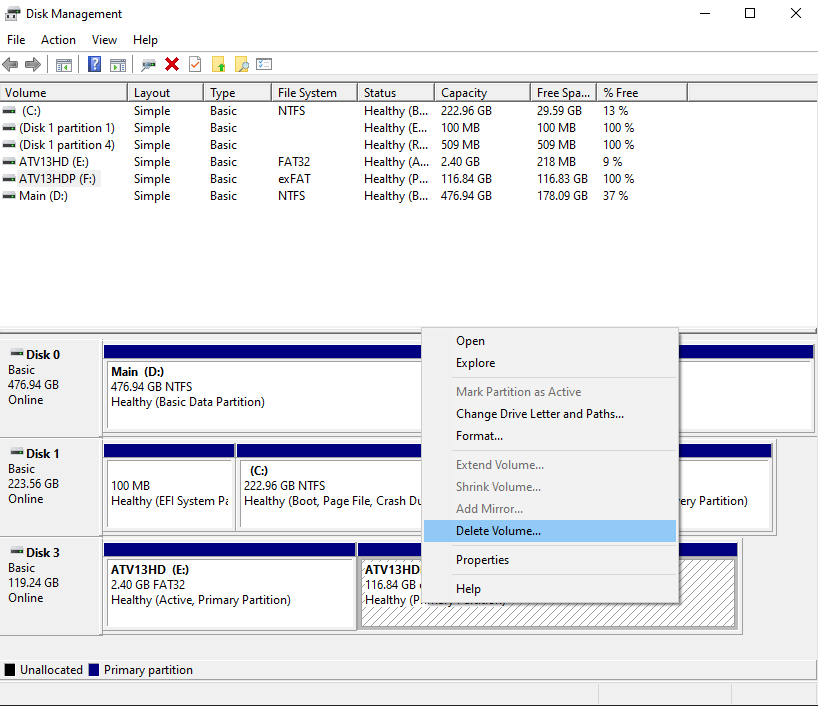
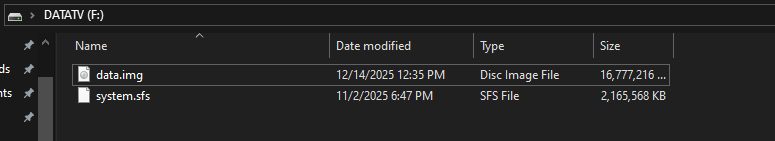

# Setup

For this, we can mount our USB / External Harddisk, but we need to determine what is the storage capacity limit.

!!! warning "Soft Reminder"

    As highlighted on the intro page, this process will wipe the data from your flash / external drive to house the boot and partition files. It is recommended you perform
    a backup of your data before commencing forward.

## Windows Only Setup

### If you have a storage drive less than 4GB

The process is simple, as we do not require extra partitioning. 

#### Setting up the drive

- Connect the storage medium to your computer, and open Rufus
- You should see your storage device listed on the top.

<figure markdown="span">
  { width="400" }
</figure>

- Go ahead and select the boot selection to ```Disk or ISO Image``` and beside it, click on ```Select``` and choose the Android TV ISO Image you downloaded from the site.
- Select the Partiton Scheme to ```GPT``` and beside it, select the Target system to ```UEFI (non CSM)```.
- Choose any name you want and apply it to the Volume Label section, and leaving the rest of the settings as is.
- Click ```Start``` to commence the flashing of the ISO file. This may take a while.
- After it's completed, we move to the next step,

#### Adding the partition files

- After you download the 2GB storages file, extract the zip file and you'll see the ```.img``` file present. Copy and paste it into the root directory of the flash drive we just flashed.

- Then, boot from the USB by going into your BIOS Boot Selection and select the USB drive. If a Security Violation error pops up, [confirm Secure Boot is disabled](../getting-started.md#prerequisites).

??? question "How to boot from USB"

    You can tap the F12 key while booting to select your boot device. When you reach the boot device selection screen, you can use the arrow keys to select the device, and hit Enter to boot.

    If your USB drive isn't showing up, while you are on the boot device selection screen, try unplugging the device and plugging it back in.

    (Varies by manufacturer, refer to your PC's specifications on how to boot from the USB drive)

Then, follow the next steps for [laptops and desktops](#if-you-have-a-laptop)

### If you have a storage drive more than 4GB

exFAT will be used and we will do some partitioning in Disk Management.

#### Setting up the drive

- Connect the storage medium to your computer, and open Rufus
- You should see your storage device listed on the top.

<figure markdown="span">
  { width="400" }
</figure>

- Go ahead and select the boot selection to ```Disk or ISO Image``` and beside it, click on ```Select``` and choose the Android TV ISO Image you downloaded from the site.
- Drag the ```Persistence Partiton Size``` slider to the absolute end.
- Select the Partiton Scheme to ```GPT``` and beside it, select the Target system to ```UEFI (non CSM)```.
- Choose any name you want and apply it to the Volume Label section, and leaving the rest of the settings as is.
- Click ```Start``` to commence the flashing of the ISO file. This may take a while.
- After it's completed, we move to the next step,

#### Making the Partitions

!!! danger "Please proceed with caution"

    We will be modifying our partitions since we are making changes to the type of filesystem. It is recommended to select the correct partition and avoid formatting the wrong one.

- Open Disk Management by hitting the Windows key and typing ```Disk Management```, the option you should see is ```Creating formatting hard drive partitions``` and hitting Enter.

- You will see a list of drives below:

<figure markdown="span">
  { width="600" }
</figure>

- As you can see, my drive where Android TV resides is Disk 3 labelled ```ATV13HD```. The partition next to it should be unspecified, so we are going to delete the partition.

<figure markdown="span">
  { width="600" }
</figure>

- Next, we are going to create an exFAT Filesystem partition where we just deleted, so right click, and select ```New Simple Volume```, cotinuously click ```Next``` 3 times, and then select the filesystem partition from the dropdown menu to exFAT, press ```Next``` and it shoudl have been formatted to exFAT.

!!! tip

    In some cases, when the exFAT option is not available, you can format to NTFS, then re-format it to exFAT

- You should be able to open the partition and it should be empty.

- Next we need to copy 2 files, one is the partition image / Storages image that you downloaded and ```system.sfs``` file.

- To do that, go over to the first partition of the USB we created and you should see ```system.sfs``` file. Cut it and paste to the partition we just made.
- Finally, go over to the storages zip file you downloaded, extract it, and cut the ```.img``` file. Paste the file in the partition we just made.

- You should see the following after correctly applying the files required:

<figure markdown="span">
  { width=800" }
</figure>

- Then, boot from the USB by going into your BIOS Boot Selection and select the USB drive. If a Security Violation error pops up, [confirm Secure Boot is disabled](../getting-started.md#prerequisites).

??? question "How to boot from USB"

    You can tap the F12 key while booting to select your boot device. When you reach the boot device selection screen, you can use the arrow keys to select the device, and hit Enter to boot.

    If your USB drive isn't showing up, while you are on the boot device selection screen, try unplugging the device and plugging it back in.

    (Varies by manufacturer, refer to your PC's specifications on how to boot from the USB drive)

See the subsections for a laptop or desktop PC below.


## If you have a laptop

Since a laptop has inbuilt display, select the first option that appears and hit 'Enter'. It will take some time as it's the initial boot. Please be patient and allow a maximum of 5 minutes. If not, [Start Again](#setting-up-the-drive)

## If you have a desktop

A desktop will have HDMI/ DP OUT so we will scroll down and see the kernel options that have ```(External Display)``` label beside it. Select the first option and wait as it's the initial boot. Please be patient and allow a maximum of 5 minutes. If not, [Start Again](#setting-up-the-drive)

After this, you can go over to the [System Setup](../Setting up your new system/Initial-OOBE-setup.md) section for a guide on installing and configuring the apps and multimedia services, or head over to [Maintenance & System](../maintenanceupdates.md) to learn how to update and keep your system optimal.

<div align=center>
  <script type='text/javascript' src='https://storage.ko-fi.com/cdn/widget/Widget_2.js'></script><script type='text/javascript'>kofiwidget2.init('Support me on Ko-fi', '#72a4f2', 'I2I51O7J3E');kofiwidget2.draw();</script> 
</div>