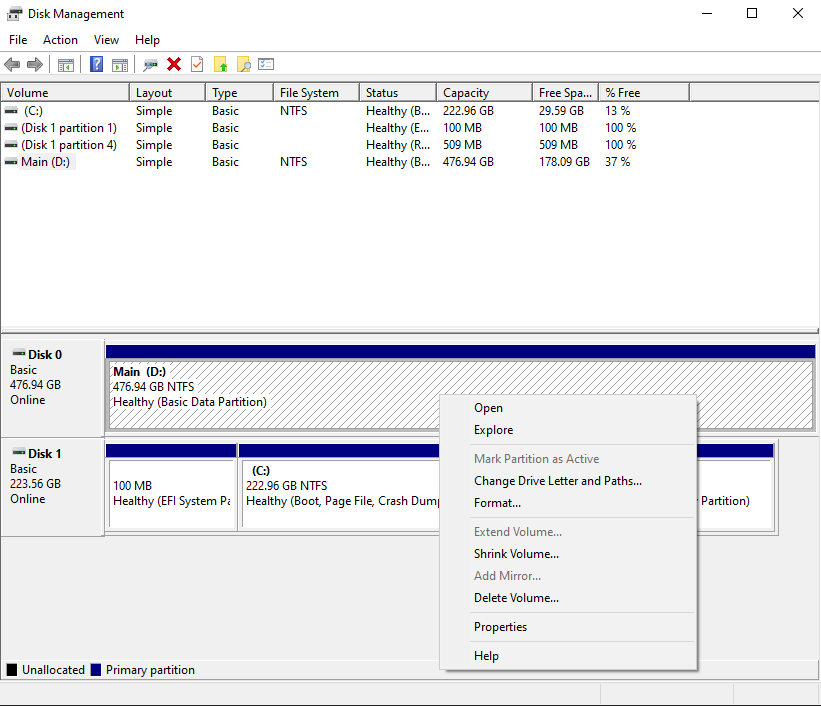
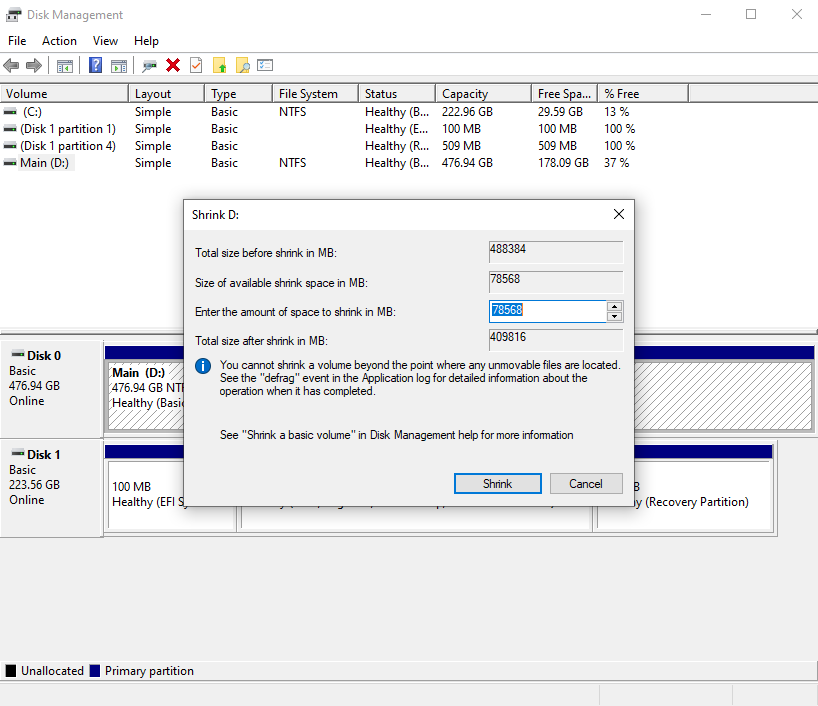
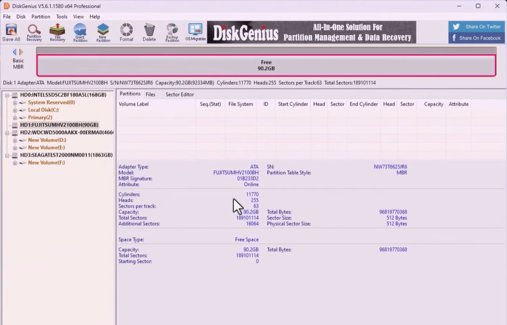
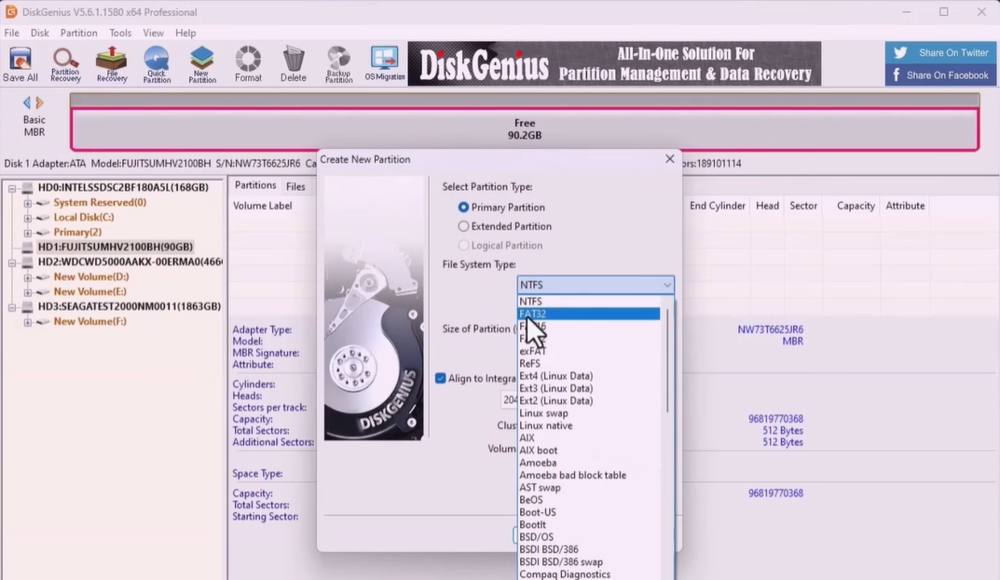
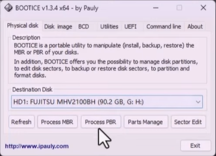
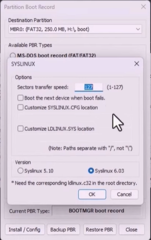

## Windows Guide
!!! danger "Proceed with caution"

    The steps detailed here perform partitioning to your internal disks. If you're performing these steps on your main drive where your operating system resides, ==PLEASE PROCEED WITH CAUTION== as one wrong move can break your boot media for your operating system.

Making the internal drive will require the following tools:

- [x] Disk Management for making the empty partition
- [x] [DiskGenius](https://diskgenius.com) for making and writing partitions
- [x] [BootICE64](https://www.majorgeeks.com/files/details/bootice_64_bit.html) for writing boot partition
- [x] Boot files from the [Android TV ISO](https://android-tvno-pc.my.canva.site) image to copy towards the boot partition
- [x] The [32GB Storage](https://github.com/ddosintruders/AndroidTVonPC/blob/main/Storages/DATA-32GB-EXT4.zip) zip file where our system's storage file will be applied.

### Steps

#### Creating the boot partition and files

- Open Disk Management by hitting the windows key on your keyboard and type 'Disk Management' and select the first option that says ```Create and format hard drive partitions```. This will open up the Disk Management Window and select the drive you want to partition off.
- Secondly, we are going to create a 64GB partition. I will showcase the steps using my internal NVME drive for better clarity.

- Right click on your internal drive and select ```Shrink volume``` and a wizard will open.

<figure markdown="span">
  { width="500" }
</figure>

In the wizard, you'll see this subsection ```Enter the amount of space to shrink in MB```. Beside to that section, you'll see pre-allocated numbers. Delete that, and add the following number ```65536```

!!! tip

    We added ```65536```because we used MB to GB conversion rate, which is 1024MB x 64 (as in the GB)

<figure markdown="span">
  { width="500" }
</figure>

- After that, select ```Shrink``` and wait for the drive to be shrinked. you will see that we have an unallocated space.

- After the creation of the unallocated drive, open DiskGenius and select the drive we made the unallocated space for, and find the unallocated partition (64GB) (In my case, we have 90GB for demonstration purposes)

<figure markdown="span">
  { width="800" }
</figure>

- From here, right click on the free space, and select ```Create New Partition``` and a wizard will open.

` You will need to select File System Type as ```FAT32``` as we are making the boot partition, then change the Partition Size Unit from GB to MB, then in the same field, add ```250```. This should report as 250 >> MB

<figure markdown="span">
  { width="800" }
</figure>

- Now set the Volume label to ```boot``` and click ```OK```. This will create a 250MB Partition that has our boot files for booting into Android TV.
- Next, we need to set the main partition where our storage file lives. Return back to the free space, right click on the free space, and select ```Create New Partition``` and a wizard will open.

- Same steps apply, except we are fully allocating our remaining space (approx 63GB) and formatting as exFAT and naming the Volume Label to ```system```. Then click ```OK```.

- Next, go ahead and verify that you have made the correct partitions for the correct drive. After, go ahead to the top left corner and hit ```Save all``` and click ```Yes``` to confirm your choice. This will start making the partitions and assign the boot and system label.

- You can check your File Explorer to see the partitions and verify them.

#### Creating the boot files for the boot volume

- Now we use BootICE64 to make the required boot volume for booting into the Android TV Bootloader.
- Open the ```BootICE64.exe``` after extracting it from the ```.rar``` file. Make sure to ==Run As Administrator==
- Once the window opens, select your destination drive of which we made the partitions, click ```Process PBR```.

<figure markdown="span">
  { width="600" }
</figure>

- After that,, another wizard will open, select ```Syslinux``` and make sure the Destination Partition is the ==250MB partition== we made.
- Another window will open, so we will click ```Ok```

<figure markdown="span">
  { width="400" }
</figure>

- A message should pop-up saying ```Successfully Changed the PBR```. We finished making the boot partition.

- Now go ahead and mount the ISO file image you downloaded, and ++ctrl+a++ and ++ctrl+c++ to select all files and copy them to our clipboard. Paste all the files to the boot partition we made by ++ctrl+v++. 

- Next, go ahead and delete the ```boot``` and ```efi``` folder in the boot partititon. We don't need them since the partition is assigned as boot already.

- Next, go ahead and cut the ```system.sfs``` file in our boot partition towards the exFAT partition we made in the same drive and paste it there. Then copy over the 32GB Storage Image file in the same exFAT partition we made.

- Voila, we made an internal installation of the Android TV. The process is lengthy and abit complex, that's why we recommend you use a Flash Drive or an external harddisk to perform the process.

- Then, boot from the drive by going into your BIOS Boot Selection and select the Android TV boot file from the Boot Menu. If a Security Violation error pops up, [confirm Secure Boot is disabled](../getting-started.md#prerequisites).

??? question "How to boot from the internal drive"

    You can tap the F12 key while booting to select your boot device. When you reach the boot device selection screen, you can use the arrow keys to select the device, and hit Enter to boot.

    If your Android TV boot file isn't showing up, while you are on the boot device selection screen, try restarting the system and going back to the boot menu. If it fails yet, [Start Again](#steps)

    (Varies by manufacturer, refer to your PC's specifications on how to enter the boot menu)

See the subsections for a laptop or desktop PC below.


## If you have a laptop

Since a laptop has inbuilt display, select the first option that appears and hit 'Enter'. It will take some time as it's the initial boot. Please be patient and allow a maximum of 5 minutes. If not, [Start Again](#setting-up-the-drive)

## If you have a desktop

A desktop will have HDMI/ DP OUT so we will scroll down and see the kernel options that have ```(External Display)``` label beside it. Select the first option and wait as it's the initial boot. Please be patient and allow a maximum of 5 minutes. If not, [Start Again](#setting-up-the-drive)


After this, you can go over to the next page ```Initial OOBE Setup``` for a guide on installing and configuring the apps and multimedia services, or head over to [Maintenance & System](../maintenanceupdates.md) to learn how to update and keep your system optimal.

<div align=center>
  <script type='text/javascript' src='https://storage.ko-fi.com/cdn/widget/Widget_2.js'></script><script type='text/javascript'>kofiwidget2.init('Support me on Ko-fi', '#72a4f2', 'I2I51O7J3E');kofiwidget2.draw();</script> 
</div>