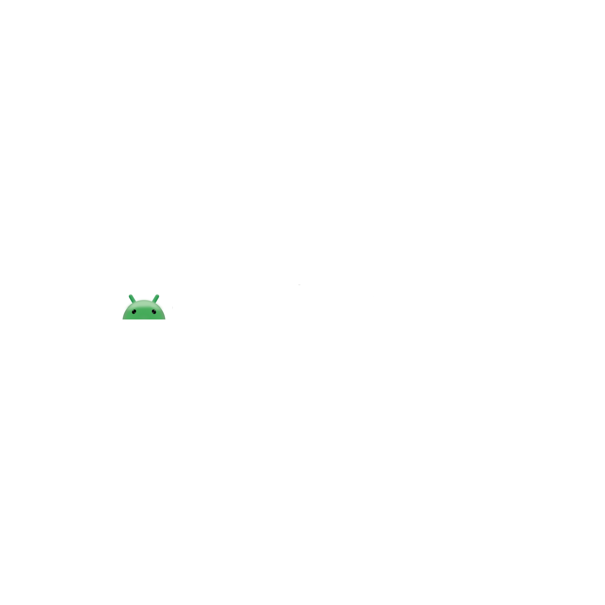

  

  <h1>Android TV on PC</h1>

    
  

This project's base items and steps are provided by TulioDomingos and ISO files are provided by hmtheboy154

>[!WARNING]
>The following steps will result in formatting your storage devices.
>It is recommended to do a backup of your data before attempting the following steps.

## Tutorial - Windows - Android TV on a USB Storage Medium

1. If Secure Boot is enabled on your system, disable it by [going into your computer's BIOS and disabling it](https://learn.microsoft.com/en-us/windows-hardware/manufacture/desktop/disabling-secure-boot?view=windows-11)
2. Use a flash drive. (4GB is minimum, 32GB and 64GB is ideal). Use a USB 3.0 Flash Drive for faster and smoother experience.
3. Grab a copy of the latest [Android TV ISO](https://android-tvno-pc.my.canva.site/) image and download it.
4. Grab a copy of [Rufus](https://rufus.ie)
5. Grab a copy of half of the storage device in the Storages folder of this repo (for example, if you have 32GB flash drive, grab the 16GB storage zip file)
6. Insert your USB and open Rufus.

### For Storage Mediums upto 4GB

1. Open Rufus, select your USB and head over to 'Boot Selection' and select `Disk or ISO image` and next to it at the end, select the Android TV ISO file you downloaded.
2. Set **Partition Scheme** to **MBR or GPT**. MBR is to be used in Legacy BIOSes and GPT for UEFI Systems. See `System Information` on Windows to determine BIOS type.
3. You can give any name to the 'Volume Label' and select `Start` to begin flashing of the USB device.
4. After the flahing is done, extract from the zip file of the storages you downloaded, and cut the `data.img` file.
5. Once complete, open the root directory of your USB file, and paste in the `data.img` file.
6. Boot from the USB by going into your BIOS Boot Selection and select the USB drive. If a Security Violation error pops up, [confirm Secure Boot is disabled](https://www.ninjaone.com/blog/confirm-if-secure-boot-is-enabled-or-disabled/)
7. A splash screen with kernel versions will pop up. If you are using a laptop, select the first option you get. If you are using a desktop or similar, scroll down and select any kernel which has `(External Display)` beside it.
8. Test the Android TV's memory by installing apps or games, then rebooting back to the USB and see if the apps or games are still there. If not, check the `data.img` file discussed in Step 4 and 5.

### For Storage Mediums above 4GB (8GB, 16GB, 32GB, 64GB, 128GB)

If you noticed, Android TV is written in FAT32, which means your maximum storage is 4GB due to FAT32's filesize limit. Microsoft made exFAT to overcome FAT32's filesize limit, so we will use that.

1. Open Rufus, select your USB and head over to `Boot Selection` and select `Disk or ISO image` and next to it at the end, select the Android TV ISO file you downloaded.
2. You will see a Persistence Partition Size beneath the selected USB Storage, drag the slider to the very end to allocate the maximum partiton image.
3. Set 'Partition Scheme' to MBR or GPT. MBR is to be used in Legacy BIOSes and GPT for UEFI Systems. See 'System Information' on Windows to determine BIOS type.
4. You can give any name to the `Volume Label` and select `Start` to begin flashing of the USB device.

>[!CAUTION]
>These next steps will require you to pay full attention to the partitons you're about to change.
>Make sure to select the correct partition/drive. Selecting the wrong partiton/drive will cause data loss and/or possible corruption to your exisiting OS Installation.

5. After flashing, go to Disk Management or `Create and format hard drive partitons` by searching it on your taskbar.
6. After opening it, you should see your USB drive will have 2 partitons, one will be FAT32 and the other will have an unrecognized filesystem (which is Persistence)
7. Select the larger partiton which we made the persistence for, right click it and select `Delete Volume`
8. After the volume is deleted, right click on the same deleted partiton and select `Create New Volume`
9. Follow the steps until you are given the option to choose a filesystem. Format it to FAT32.
10. After, right click on the same partiton and select `Format`. This should give you an option to select the filesystem. Select the exFAT filesystem and let it format.
11. After the format is finished, go to your USB in File Explorer, you should see 2 partitions. Go to the FAT32 partiton.
12. You should see a file named `system.sfs`. Cut it, and paste it in the exFAT partiton we made.
13. Now go to the Storage zip file you downloaded, extract it and place the `data.img` file to the exFAT partition.
14. Your USB is now set to be used. Refer to the previous tutorial for 4GB Storage Mediums from Step 6 to 8

You should have a functional Android TV on a USB drive.

## Updating your current Android TV Installation without loosing any of your apps/games

To update your current installation on your USB Storage Medium, follow these steps:

1. Go to [TulioDomingos's Website](https://android-tvno-pc.my.canva.site/) and get the latest ISO file, and download it.
2. After the download is complete, mount the ISO image and copy the `system.sfs` file
3. Paste the sfs file in your persistence partiton (which contains the `data.img` and `system.sfs`

This will overwrite the old `system.sfs` file with the one you got from the new ISO file.

## Additional Improvements and Notes

1. An improvement is underway to utilise bigger storage mediums by creating bigger storage images.

2. If you want remote control, download [Bluetooth Remote](https://play.google.com/store/apps/details?id=com.app.bluetoothremote&hl=en-US&pli=1) from Google Play Store on your Android Phone, pair it with your custom Google/Android TV. You need a BLE-Supported Phone (most phones have it nowadays), or buy a [Bluetooth Remote](https://www.amazon.com/GREVA-Bluetooth-Keyboard-Rechargeable-Projector/dp/B0DP2KDRYC?crid=3SSUTNUSU6WZR&dib=eyJ2IjoiMSJ9.6V9u49GBDp6fg4HK5Gn3Fpz29cKrZ0kcTInmHJxHeVemV-MNRAiT9WPQ65nb1yzrVwuQwJf6PoUXnkrGwr3sf5nxtV94_prQ5-6ZctK2oTr5BLfMeP5Ktz18QLkhqI9tAxYx28I-HvYfxm7ilAa2KaPwPUi7yv2IpL2I7t_XMKnaTA0xOA_IIlG1Zmu4wUIpKWmcxbT1fAa15B1IC_CScA5w6pOsXwd8jmnhA5UAN_M.F1vduTxABYOKc7oTLhilnxg0S9Gn8oz0LPB2lhRuX6A&dib_tag=se&keywords=bluetooth+remote&qid=1762762114&sprefix=bluetooth+remotw%2Caps%2C476&sr=8-13) if you do not prefer using your phone. Your computer/laptop must have Bluetooth functionality to be able to use Bluetooth Remote. If not, purchase a [USB Bluetooth Dongle](https://www.amazon.com/Smart-Bluetooth-Adapter-Windows-Vista/dp/B08MWRC4BG?crid=3MC0NVQSV7MZ&dib=eyJ2IjoiMSJ9.sFlGDwesuQ4zmzcGlnGBWEp2IHVYuKu0M-jE0fSuOuYc_Z1aVv4ZnF8y7nIa_rXRjOot-5bf5SXp3nJHvtKNv0qg6BJxijCo9gqTkmAY48J3w3gvPvi-PzkGyOAJ3mAuvS1WKAgyCo7FF9U3VRlsP0eaQxsXQVgMz9n774DNSmA9UdreJlDUrT36PXVvWnF5gIFQfdUaktdhe4Yql2qis3cgyhsWv2j8YtJR75lpWlU.wrJVkdrYMPxN3CskLVxtKcoEMUL4IMMGuJbYOBBGBns&dib_tag=se&keywords=usb%2Bbluetooth%2Badapter%2Bfor%2Bpc%2Blinux&qid=1762761787&sprefix=usb%2Bbluetooth%2Badapter%2Bfor%2Bpc%2Bli%2Caps%2C1110&sr=8-6&th=1) or install an [M.2 Wi-Fi+Bluetooth Network Card](https://www.amazon.com/TP-Link-Bluetooth-Receiver-Controller-UB500/dp/B09DMP6T22?crid=3U0PB7N2JMJH8&dib=eyJ2IjoiMSJ9.G2Edfn60_s5eJg6TIHinZXkDPYCPLCz5FekvRBsNyibIsJ8uAjm6uE2vIj6mL4b3ZZR3vh0g-e71TwdE8-vlAWzqAYqBCkuQknVlsY6iLVtUbjZb-kqLB2XtbxktAxIdb1XRaxrJPDzMh30TK-7e2APRMLmKQPusnNKfWMiPlQ8vQn6eOoqfVvhh6fF8hxm-mOppl-wYQ0hX1OqxPR_DSHcb4dQkGv0xVR50gR2-qlo.AxR9f3Y6RZA9od5eDjYR3jQrFRAiLA0UjpY1DFKCSyY&dib_tag=se&keywords=usb%2Bbluetooth%2Badapter%2Bfor%2Bpc&qid=1762761408&sprefix=USB%2BBluetooth%2Caps%2C370&sr=8-3&th=1) (check you computer if it has an already existing network card)

5.  If you need Android TV installed directly on your harddisk, be prepared. You won't utilise the full storage if you have 256GB or more. Best to stick with a USB Flah Drive or an external SSD until a solution to Note 1 is developed.

  

